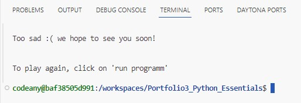
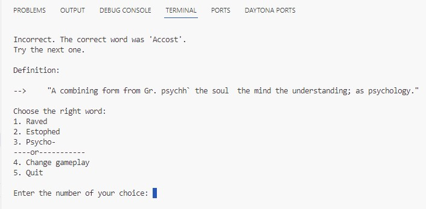

# Portfolio 3 - Python Essential

## Word guess game

## Project description

This website is a word game based on a free english dictionary. 

The goals for the end user are:
- to test his/her knowledges of the english language
- to learn new words
- to play
- to have fun

The player can chose between two ways of playing. Either try to guess the definition of a given word, or the opposite, try to guess a word of a given definition.

The word and the definition that the player is looking for are randomly chosen and given by the programm.

The player can chose amongs 3 solutions, only one of them is true, the 2 others are randomly chosen by the programm. All given choices suggested by the programm must be different from one another. No repeatition is allowed.

Have fun with the game, and learn new words!

## Features:

This app contains 7 functions, including the main fonction.

1) clear_console(): allows to clear the command prompt in order to keep the command line as clean as possible, it makes easier to read the prompt 
2) get_random_options(correct_value, field): allows to generate random values for the functions "guess_word" and "guess_definition"
3) guess_word(): allows to get a question about a random word
4) guess_definition(): allows to get a question about a random definition
5) first_question(): the "yes or no" question at the begining
6) second_question(): the second question "choose a gameplay"
7) main(): allows the player to enjoy himself/herself

## Testing:

### Data Cleaning Process
During the analysis, several issues were identified in the data, and appropriate steps were taken to resolve them:

#### Issues and Solutions
1. Redundant Alphabet Entries:

- Issue: The dataset contained multiple entries for each letter of the alphabet, which were redundant.
- Solution: Erased all rows where the "Count" column contained "1".

2. Empty POS (Part of Speech):

- Issue: Some POS entries were empty, particularly for alphabet letters and proper nouns.
- Solution: Implemented an exception in the program to exclude empty POS entries from being selected for the game.

3. Erroneous Data Entries:

- Issue: Certain entries contained errors or displayed as #NAME?.
- Solution: Removed all rows containing such errors.

4. Irrelevant High Count Entries:

- Issue: Two entries with counts of 70 and 83, which did not add value to the game:
 - ", a , or an . PCP. It is presumably an older spelling of scanned. --2."
 - ", a , or an . PCP. It is presumably an older spelling of scanned. --2. Specifically"
- Solution: Removed these two entries.

5. POS Consolidation:

- Issue: Some POS entries were unique or reversed, such as "n. & v.", "v. & n.", and "n. & v. t.".
- Solution: Decided to leave these as they are since POS would not be used.

6. Repeated Words:

- Issue: Some words were repeated for each definition they had.
- Solution: Deleted every second and subsequent repetition of the same word.

7. Empty Rows:

- Issue: Verified that there were no empty rows in the dataset.

#### Data Cleaning Script
To facilitate the cleaning process, a new Python file named datacleaning.py was created. The original sheet in the Google Sheet was duplicated and renamed to "Original.." to keep track of the modifications.

### Dealing with exception:

#### Testing response from the programm:

1. First question "yes/no":

    a) Invalid input = "z"
       Output = coming back! with error message

       

    b) Valid input = "n"
       Output = quit!

       

    c) Valid input = "y"
       Output = game!

       

2. Second question "choose a gameplay":

    a) Invalid input = "8"
       Output = coming back! with error message

       

    b) Valid input = "1"
       Output = game question "Guess a word"

       

    c) Valid input = "2"
       Output = game question "Guess a definition"

       

    d) Valid input = "3"
       Output = exit game

       

3. Game question "Guess a word":

    a) Invalid input = "/////"
       Output = giving the possible choices again with error message

       

    b) Valid input = "1" to "3"

       A) right answer:
        Output = "Congrats! Your answer is Correct!" + next question

       

       B) wrong answer:
        Output = "Incorrect. The correct word was ..." + next question

       

    c) Valid input = "4"
       Output = back to "Choose a gameplay" see point 2 above

       

    d) Valid input = "5"
       Output = exit game

       

4. Game question "Guess a definition":

    a) Invalid input = "&%/()"
       Output = giving the possible choices again with error message

       

    b) Valid input "1" to "3"

       A) right answer:

       

       B) wrong answer:

       

    c) Valid input = "4"
       Output = back to "Choose a gameplay" see point 2 above

       

    d) Valid input = "5"
       Output = exit game

                        

## Technologies Used

- Python

## Special library

- none

## Credits

I used a csv file containing an open source English Dictionary, here are the references:

The Online Plain Text English Dictionary (OPTED) [kaggle.com](https://www.kaggle.com/datasets/dfydata/the-online-plain-text-english-dictionary-opted?resource=download/)

Dictionary in CSV Format Based on the Webster's Dictionary 1913 Edition.

This is the full OPTED version of a Public Domain dictionary based on the Webster's Unabridged Dictionary, 1913 edition. The CSV file contains all entries, along with the character count for each word, the Part of Speech, and the Definition.

### Code

- I found help on [stackoverflow.com](https://stackoverflow.com/)
- I also used CodeInstitute examples

### Content

- All content was written by myself

### Media

- no images were used for this project, appart from the readme file

## Deployment

1. Create an account with Heroku
2. Log in to Heroku
3. Create an app with Heroku after giving my credit card infos
4. In settings giving Config Vars, also the 'PORT' one. Giving also two Buildpacks : python and nodejs (in this order)
5. Connecting Heroku to my Git Hub and locat the [GitHub Repository](https://github.com/Cyril-CRGB/Portfolio3_Python_Essentials.git)
6. Then Deploy manually the application

## Find this web site:

[My Second Project live](https://portfolio3pythonessentials-778015e492b0.herokuapp.com/)

[My page on GitHub](https://github.com/Cyril-CRGB/Portfolio3_Python_Essentials.git)